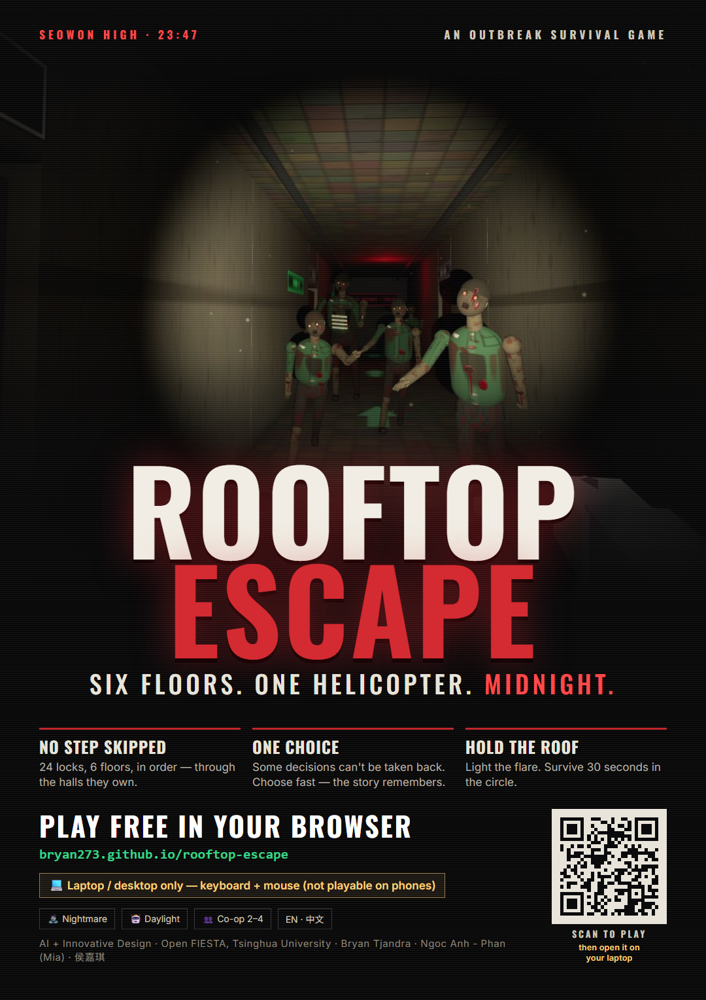

# 🧟 ROOFTOP ESCAPE — Outbreak

> **▶ PLAY IT LIVE: https://bryan273.github.io/rooftop-escape/**
>
> 🌐 [Landing page](index.html) · 🎮 [Game](play.html) · 📄 [Project document](docs/PROJECT.md) · 🖼️ [Poster](poster.png) · 🛠 [Design reference](DESIGN.md)



A 3D first-person zombie survival escape game that runs in the browser. Inspired by *All of Us Are Dead*, with PUBG-style audio indicators and escape-room puzzles.

**The story:** a study night at Seowon High goes wrong. At 23:12 a scream comes from the biology lab on Floor 5, and at 23:36 the school shuts itself down: the gates lock, and the elevators and power are cut. You wake up in the entrance hall. A military helicopter will land on the roof at midnight, but only if it sees a signal flare. Six floors stand between you and the roof.

## 🌐 Languages

**English / 简体中文.** Switch with the buttons on the menu. Everything is translated, and switching mid-run rebuilds the world without losing your progress.

## 🎭 Two game modes

| | 🧟 **NIGHTMARE** | 🤖 **DAYLIGHT DRILL** |
|---|---|---|
| Vibe | Dark, tense, gory | Bright, silly, zero scares |
| Enemies | Zombies (red glowing eyes) | Helper-bots with screen faces |
| Lighting | Emergency lights on the lower floors only; Floors 4–6 have **no power** | Fully lit |
| Balance | Full damage/speed | −50 % damage, −15 % speed, more loot |

In co-op, **the host's mode applies to the whole squad**.

## 🗺 The mission chain (24 steps, strictly in order)

Every step has to be finished before the next one unlocks. Anything that belongs to a later step refuses and tells you what to do first, so no step can be skipped. The panel at the top left always shows the current step, **where** it is and **which key** to use. Hold **[Tab]** to see the whole plan.

| Floor | Steps |
|---|---|
| Ground | Flashlight at reception → kick the janitor closet open (tap **Q** ×3) → take the crowbar |
| 1 | Pry the boards off the stairwell gate (**hold Q**) |
| 2 | Find the security room → watch the CCTV archive → red keycard → start the generator → open the gate with the red card |
| 3 | **Mr. Park** lies bitten right outside the stairwell → talk to him (**E**) → take his blue card → he turns → **put him down** |
| 2 (back down) | Release the Floor 3 shutter from the CCTV terminal (**Q** in the terminal) |
| 4 | The dark floor: reset the utility breaker → open the gate with the blue card |
| 5 | Containment breach. **Find Ji-eun** (no marker; listen for her) in the room zombies can't enter → talk to her → **decide in 7 seconds: trust her or kill her**. Trust her and she comes along, exhausted (give her a medkit with **[E]**); take too long and they find you both. Zombies attack her too (160 HP); if she dies she turns |
| 5–6 | Open the Floor 5 gate (the breaker released it) → open the rooftop gate with the yellow card |
| Roof | **Light the signal flare** in the circle (hold Q) → **stay in the circle for 30 s** while the building empties onto the roof. Stepping out makes the clock run backwards |

## 🎮 Controls

| Key | Action |
|---|---|
| **W A S D** | Move |
| **Mouse** / **Arrow keys** | Look (click the game once to capture the mouse) |
| **Shift** | Sprint (loud, attracts enemies) |
| **Space** | Jump |
| **E** | Take items · open/close doors · read notes · use the terminal · swipe keycards · talk to survivors (again for the next line) · respawn |
| **Q** | Physical work: **tap** to kick boards in, **hold** to pry boards, pull a breaker, light the flare or revive a friend (let go at any time: progress is kept) · release the shutter in the terminal |
| **F** | Flashlight (drains battery) |
| **G** | Throw a flare (lures enemies away; on the roof it pulls attackers off you) |
| **H** | Use a medkit (+60 HP) |
| **C** | Crouch / sneak |
| **1 / 2** | Crowbar / SMG |
| **LMB** | Attack. Hold it for **full-auto** with the SMG |
| **V** | 1st / 3rd person |
| **Tab** (hold) | Mission plan |
| **T / Z** | Chat / ping (co-op) |
| **Esc** | Pause / settings |

The prompt in the middle of the screen always shows the key: amber **E**, blue **Q / HOLD Q**. Prompts appear only for things you can actually see; nothing works through a wall.

## 🧠 How to survive

- **Weapons:** the **SMG** is on the security desk (Floor 2). It comes with 30 rounds, and every ammo box adds 20. Ammo rooms: **STORAGE** (Floor 3, north-west), **ARMORY** (Floor 5, north-east) and a crate on the roof. Hold LMB to fire. Head shots do double damage. Walls stop bullets. The **crowbar** does double damage from behind and still connects when a zombie is right in your face.
- **Read the ring.** The circle around your crosshair shows where enemies are moving. Red means one is chasing you.
- **Light is a resource.** Floors 4–6 have no power. Pick up batteries, and the bar updates as soon as you do.
- **Flares > fights.** Throw one and walk the other way.
- **Ji-eun is a decision, not a cutscene.** Nothing tells you whether she is bitten. You get 7 seconds and two buttons. Whatever you choose, the run goes on.
- **The rooftop** is the hardest fight: the zombies up there always know where you are (small waves every 11 s, at most 30 in total). Keep medkits and ammo for it, and throw a flare when they bunch up.

## 🔊 Audio

- Recorded sound effects (Mixkit free license) in `assets/sfx/`: footsteps, door creaks, heartbeat, gunshots, alarms, roars. There is also a real helicopter loop and thunder in `assets/`.
- CC0 zombie voice recordings (OpenGameArt) are embedded in `js/vox.js` and mixed with the samples for variety.
- Every sound also has a synthesized fallback, so the game never goes silent.
- Debug: add `?heartonly=1` to the URL to mute everything except the heartbeat.

## 📁 Project layout

```
index.html        landing page (the public URL opens this)
play.html         the game page
poster.html/.png  promotional poster (source + exported image)
docs/PROJECT.md   standalone project document (for judges / developers)
css/landing.css   landing page styles
css/style.css     game styles
js/game.js        the game (one ES module: world, AI, missions, UI, co-op)
js/vox.js         embedded zombie voice clips (generated by _assets/embed_vox.py)
assets/           recorded sound effects + helicopter / thunder; assets/promo/ key art + QR code
_sim/             headless test harness (Node)
_assets/          source mp3s for js/vox.js
.nojekyll         serve the folder as-is on GitHub Pages
```

## ▶ Run it locally

The game uses ES modules and loads sound files, so it needs a local web server. Opening the HTML files by double-clicking won't work.

```bash
python -m http.server 8080     # then open http://localhost:8080 (landing) or /play.html (game)
# or: npx serve .
```

After pulling updates, hard-refresh with **Ctrl+F5**. Add `?nolock=1` for trackpad/debug mode, which doesn't pause when the mouse isn't captured.

## 🧪 Tests

A headless simulation runs the real game code in Node. It plays the whole mission chain with real key presses and checks every step, the skip protection, combat, stairs, reachability, saves, translations and rooftop difficulty (a fighting bot must survive).

```bash
npm test                          # Nightmare + Daylight
npm run test:zh                   # Chinese
npm run test:coop                 # co-op world (4 tool sets)
```

## 👥 Co-op multiplayer

1. One player clicks **Host Co-op** and gets a 5-letter room code.
2. Friends click **Join Co-op** and type the code.
3. The host presses **Start**.

- The host's browser runs the world. Mission progress is shared by the whole squad.
- Downed friends can be revived by **holding Q** next to them.
- Co-op tries a direct peer-to-peer connection first (PeerJS/WebRTC). If that is blocked (VPN/proxy apps such as Clash in TUN mode, campus Wi-Fi that isolates devices, strict NAT), it switches automatically after ~6 s to a relay through a free public MQTT broker over secure WebSocket, so friends on different networks or behind a VPN can still play. The relay adds ~0.1–0.3 s of lag. Public brokers are unauthenticated: only game state is sent, keyed by the room code.
- Co-op extras: **[B]** give a nearby friend a medkit, ammo, your SMG, battery or a flare · **[M]** microphone on/off · **[N]** friends' voices on/off (voice chat works over direct and relay connections). Keycards are shared ("taken by …" moves the mission on for everyone); other loot is personal, so everyone can grab their own crowbar, gun and medkits. A friend can revive you up to 3 times (you come back at half health); after that — or if nobody comes — you turn into a named zombie your friends must put down, and you watch the rest through their eyes (spectator: A/D to switch, or quit).

## 🌍 Deploy (GitHub Pages)

Push the repository and enable **Settings → Pages → Deploy from branch → main / root**. All paths are relative and `.nojekyll` is included, so the site works as-is at `https://<you>.github.io/<repo>/`. Netlify Drop, Vercel and itch.io also work: upload the whole folder, not just `index.html`.

## 🛠 Troubleshooting

| Symptom | Fix |
|---|---|
| Black screen or nothing loads | Serve the folder over http (see above); Three.js loads from a CDN, so go online once. |
| Old behaviour after an update | Hard-refresh (Ctrl+F5). |
| No sound | Browsers start audio only after a click. |
| Mouse doesn't turn | Click the game once (or use `?nolock=1`). |
| Friend can't join | Try a phone hotspot; strict networks block WebRTC. |

---
The infected wear the school's green uniform, each with their own bleeding wounds and their own broken walk (limp, dragging leg, dead arm, twitching neck). Mr. Park keeps his teacher's suit.

Made with Three.js + Web Audio + PeerJS. Zombie voices CC0 via OpenGameArt; sound effects from Mixkit (free license). Fan-made and non-commercial.
